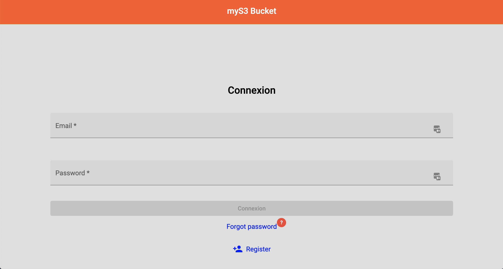
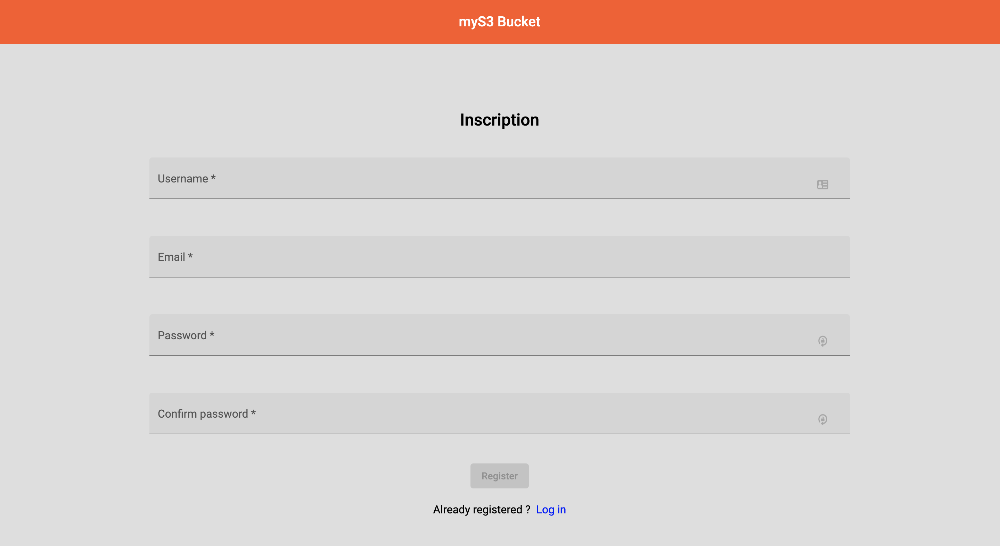

# MyS3

# Introduction
MyS3 bucket is a web application that allows a user to have a driver
files are storage on AWS S3

#Architecture
    Is it a PWA app
* Angular 7
* Angular Material
* Prime Ng

## Screen

